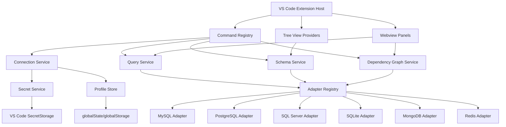
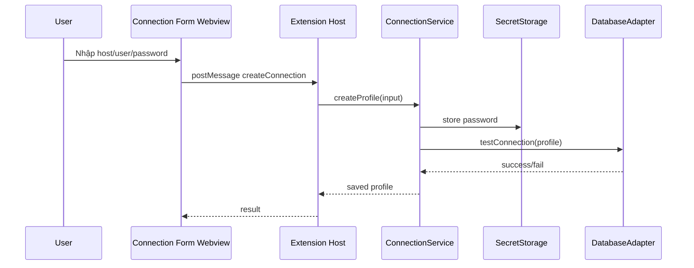
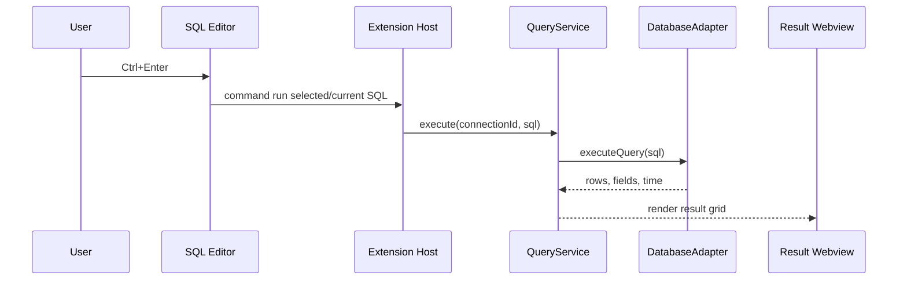
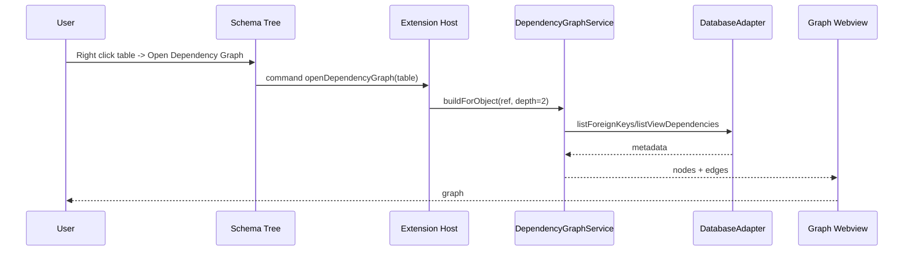

# 02 — System Architecture

## 1. Kiến trúc tổng quan



## 2. Các module chính

### 2.1 Extension Entry

File:

```txt
src/extension.ts
```

Nhiệm vụ:

- Activate extension.
- Register commands.
- Register TreeDataProvider.
- Register Webview providers.
- Khởi tạo service container.
- Dispose resource khi extension deactivate.

### 2.2 Command Registry

File:

```txt
src/commands/registerCommands.ts
```

Nhóm command:

```txt
openDbNexus.addConnection
openDbNexus.editConnection
openDbNexus.deleteConnection
openDbNexus.testConnection
openDbNexus.refreshSchema
openDbNexus.openQuery
openDbNexus.runSelectedQuery
openDbNexus.openTable
openDbNexus.openDDL
openDbNexus.openDependencyGraph
openDbNexus.exportResult
```

### 2.3 Tree View Providers

File:

```txt
src/views/databaseExplorer/DatabaseTreeProvider.ts
```

Nhiệm vụ:

- Hiển thị connection.
- Hiển thị database/schema/table/view/procedure.
- Context menu theo loại node.
- Lazy load object con.
- Refresh node.

### 2.4 Webview Panels

Các panel chính:

```txt
src/webviews/queryResult/
src/webviews/tableViewer/
src/webviews/dependencyGraph/
src/webviews/connectionForm/
```

Nhiệm vụ:

- Render UI phức tạp.
- Nhận message từ extension host.
- Gửi action về extension host.
- Tôn trọng VS Code theme.
- Có Content Security Policy.

## 3. Service Layer

### 3.1 ConnectionService

Nhiệm vụ:

- Tạo/sửa/xóa profile.
- Test connection.
- Tạo connection runtime.
- Quản lý connection pool.
- Đóng connection khi không dùng.

Pseudo API:

```ts
class ConnectionService {
  createProfile(input: CreateProfileInput): Promise<ConnectionProfile>;
  updateProfile(id: string, input: UpdateProfileInput): Promise<void>;
  deleteProfile(id: string): Promise<void>;
  testProfile(id: string): Promise<TestResult>;
  getRuntimeConnection(id: string): Promise<DbConnection>;
  closeConnection(id: string): Promise<void>;
}
```

### 3.2 SchemaService

Nhiệm vụ:

- Load metadata.
- Cache schema.
- Refresh schema.
- Search object.

```ts
class SchemaService {
  getDatabases(connectionId: string): Promise<DatabaseInfo[]>;
  getSchemas(connectionId: string, database: string): Promise<SchemaInfo[]>;
  getTables(connectionId: string, schema: string): Promise<TableInfo[]>;
  getColumns(connectionId: string, table: ObjectRef): Promise<ColumnInfo[]>;
  refresh(connectionId: string): Promise<void>;
  search(connectionId: string, keyword: string): Promise<SearchResult[]>;
}
```

### 3.3 QueryService

Nhiệm vụ:

- Parse selected/current query.
- Execute query.
- Stream/paginate result.
- Save history.
- Handle cancellation.
- Format errors.

```ts
class QueryService {
  execute(connectionId: string, sql: string, options: QueryOptions): Promise<QueryResult>;
  cancel(queryId: string): Promise<void>;
  getHistory(connectionId?: string): Promise<QueryHistoryItem[]>;
}
```

### 3.4 DependencyGraphService

Nhiệm vụ:

- Lấy FK metadata.
- Lấy view/procedure dependency nếu DBMS hỗ trợ.
- Build graph node/edge.
- Tính inbound/outbound.
- Tính depth.
- Detect cycle.
- Export graph.

```ts
class DependencyGraphService {
  buildForObject(
    connectionId: string,
    ref: ObjectRef,
    options: GraphOptions
  ): Promise<DependencyGraph>;
  buildFullSchema(connectionId: string, schema: string): Promise<DependencyGraph>;
}
```

## 4. Adapter Registry

```ts
class AdapterRegistry {
  private adapters = new Map<DbType, DatabaseAdapter>();

  register(type: DbType, adapter: DatabaseAdapter) {
    this.adapters.set(type, adapter);
  }

  get(type: DbType): DatabaseAdapter {
    const adapter = this.adapters.get(type);
    if (!adapter) throw new Error(`Unsupported database type: ${type}`);
    return adapter;
  }
}
```

## 5. Luồng chạy connection



## 6. Luồng chạy query



## 7. Luồng dependency graph



## 8. Cách tách package

Khuyến nghị monorepo nhẹ:

```txt
packages/
├── extension/
├── shared/
├── webview-ui/
└── db-adapters/
```

Hoặc ban đầu dùng một package:

```txt
src/
├── adapters/
├── commands/
├── core/
├── services/
├── storage/
├── views/
├── webviews/
├── utils/
└── extension.ts
```

## 9. Nguyên tắc chống phình code

- UI gọi service, không gọi driver trực tiếp.
- Adapter trả dữ liệu chuẩn hóa, không trả raw driver object ra UI.
- Mỗi DBMS có metadata query riêng.
- Không nhét hết command vào `extension.ts`.
- Không hardcode password/token vào setting JSON.
- Không để webview tự connect database.
- Không import driver nặng nếu DBMS chưa dùng, có thể lazy import.
