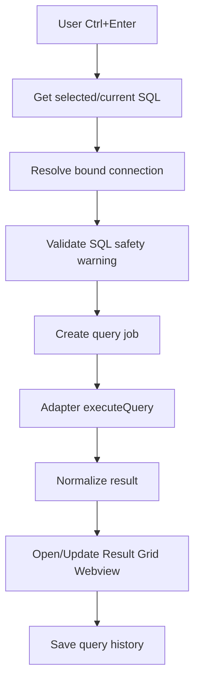
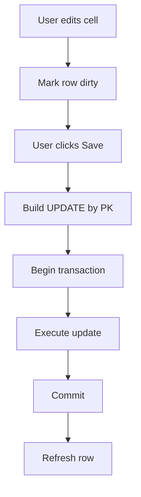

# 06 — Query Runner and Result Grid

## 1. Mục tiêu

Query Runner giúp người dùng chạy SQL ngay trong VS Code, còn Result Grid hiển thị dữ liệu dạng bảng có thể copy, export, filter, sort.

### Trạng thái triển khai (v1.1.0)

- ✅ Query Editor gắn connection; chạy selected/current/all statement, result grid, error normalization, query history và hủy theo `AbortSignal` cơ bản.
- ✅ Table Data viewer do extension sinh query, phân trang server-side 100 dòng/trang cho các SQL adapter hỗ trợ.
- ⏳ Edit data, filter/sort UI, import/export CSV/XLSX, virtual scroll, query safety guard và cancel thật theo driver vẫn thuộc roadmap `v1.2.0+`.

## 2. Các chế độ chạy query

| Mode               | Mô tả                             |
| ------------------ | --------------------------------- |
| Run Selected Query | Chạy phần SQL đang bôi đen        |
| Run Current Query  | Chạy statement tại vị trí cursor  |
| Run All            | Chạy toàn bộ file                 |
| Run Explain        | Chạy explain/plan nếu DBMS hỗ trợ |
| Run Transaction    | Chạy trong transaction thủ công   |

## 3. Tách statement

MVP có thể tách theo dấu `;`, nhưng cần cẩn thận vì:

- String có thể chứa `;`.
- Function/procedure có block.
- PostgreSQL có dollar quote.
- SQL Server có `GO`.

Khuyến nghị:

- MVP: đơn giản, tách selected text hoặc current block.
- Phase sau: dùng parser thư viện hoặc viết tokenizer nhẹ.

## 4. Query Execution Flow



## 5. Query Job

```ts
type QueryJob = {
  id: string;
  connectionId: string;
  sql: string;
  status: "queued" | "running" | "success" | "error" | "cancelled";
  startedAt?: string;
  endedAt?: string;
  durationMs?: number;
  error?: DbError;
};
```

## 6. Query Options

```ts
type QueryOptions = {
  maxRows?: number;
  timeoutMs?: number;
  readonly?: boolean;
  transaction?: boolean;
  signal?: AbortSignal;
};
```

## 7. Query Result

```ts
type QueryResult = {
  queryId: string;
  columns: QueryColumn[];
  rows: QueryRow[];
  rowCount: number;
  affectedRows?: number;
  durationMs: number;
  warnings?: string[];
  meta?: Record<string, unknown>;
};

type QueryColumn = {
  name: string;
  dataType?: string;
  nullable?: boolean;
  ordinal: number;
};

type QueryRow = Record<string, unknown>;
```

## 8. Result Grid UI

Result Grid nên là webview.

Chức năng:

- Virtual scroll.
- Copy cell.
- Copy row as JSON.
- Copy table as CSV.
- Export CSV/JSON.
- Filter local.
- Sort local.
- Freeze header.
- Show NULL khác empty string.
- Show binary/blob dưới dạng placeholder.
- Show JSON cell có format viewer.

## 9. Result Grid Layout

```txt
┌─────────────────────────────────────────────────────────────┐
│ Query finished in 25ms | 128 rows | Export CSV | Export JSON │
├──────────────┬───────────────┬───────────────┬──────────────┤
│ id           │ name          │ email         │ created_at   │
├──────────────┼───────────────┼───────────────┼──────────────┤
│ 1            │ Sang          │ ...           │ ...          │
│ 2            │ Minh          │ ...           │ ...          │
└──────────────┴───────────────┴───────────────┴──────────────┘
```

## 10. Safety Warning

Trước khi chạy query nguy hiểm:

```sql
DELETE FROM users;
UPDATE products SET price = 0;
DROP TABLE orders;
TRUNCATE TABLE logs;
```

Extension nên hỏi confirm:

```txt
This query may modify many rows. Continue?
```

Rule MVP:

```ts
const dangerousPatterns = [
  /^\s*delete\s+from\s+\w+\s*;?\s*$/i,
  /^\s*update\s+\w+\s+set\s+.+;?\s*$/i,
  /^\s*drop\s+/i,
  /^\s*truncate\s+/i
];
```

Không thể đảm bảo 100%, nhưng giúp tránh lỗi cơ bản.

## 11. Query History

Schema:

```ts
type QueryHistoryItem = {
  id: string;
  connectionId: string;
  database?: string;
  schema?: string;
  sql: string;
  status: "success" | "error" | "cancelled";
  durationMs?: number;
  rowCount?: number;
  errorMessage?: string;
  createdAt: string;
};
```

Lưu:

```txt
globalStorage/query-history.jsonl
```

Vì sao JSONL?

- Append nhanh.
- Dễ rotate.
- Không phải parse toàn bộ file lớn khi ghi.

## 12. History UI

- Recent queries.
- Search SQL text.
- Filter by connection.
- Pin favorite.
- Re-run query.
- Copy query.
- Open as SQL document.

## 13. Table Viewer

Table viewer là query đặc biệt do extension sinh.

Ví dụ PostgreSQL:

```sql
SELECT *
FROM "public"."orders"
LIMIT 100 OFFSET 0;
```

Tính năng:

- Pagination.
- Filter builder đơn giản.
- Sort column.
- Edit cell.
- Insert row.
- Delete row.
- Save changes bằng transaction.

## 14. Edit Row Strategy

Không edit trực tiếp từng cell nếu chưa có primary key.

Điều kiện cho phép edit:

- Table có primary key.
- Query là table viewer, không phải custom query.
- User có permission update.

Flow:



## 15. Export

### CSV

- Escape comma.
- Escape quote.
- Preserve newline.
- UTF-8 BOM option cho Excel.

### JSON

```json
[
  {
    "id": 1,
    "name": "Sang"
  }
]
```

### SQL Insert

```sql
INSERT INTO users (id, name) VALUES (1, 'Sang');
```

## 16. Performance Notes

Không nên:

- Render 100k rows vào DOM.
- Load toàn bộ table khi mở.
- Ghi history vô hạn không rotate.
- Block extension host bằng xử lý CSV quá lớn.

Nên:

- Limit mặc định 1000 rows.
- Virtualize grid.
- Export lớn bằng stream.
- Hiển thị warning khi result lớn.
- Có cancel query.
