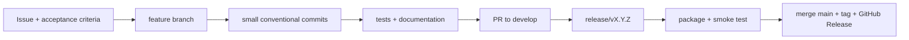

# 11 — Phases, GitHub Commits and Versioning

Tài liệu này quản lý version và Git workflow. Phạm vi/acceptance criteria của từng phase ở [08-development-roadmap.md](08-development-roadmap.md); trạng thái feature chi tiết ở [12-future-features.md](12-future-features.md).

## 0. Setup GitHub CLI (`gh`)

Dùng GitHub CLI để đăng nhập, push branch, tạo release và upload `.vsix` trực tiếp từ terminal.

### Windows

```powershell
winget install --id GitHub.cli
gh auth login
gh auth status
```

Chọn `GitHub.com`, `HTTPS`, và `Login with a web browser` nếu bạn chưa có token sẵn. Sau khi login, kiểm tra quyền repo:

```powershell
gh repo view PiupiuTenshi/Database-Client
git remote -v
```

Nếu repo local chưa có remote:

```bash
git remote add origin https://github.com/PiupiuTenshi/Database-Client.git
```

Tài khoản GitHub cần có quyền push vào repo và tạo release. Nếu `gh release create` báo lỗi permission, chạy lại `gh auth login` và chọn scope có quyền repo.

## 1. Trạng thái phát hành

| Phase | Version            | Commit phát hành                | Nội dung                                                                             |
| ----- | ------------------ | ------------------------------- | ------------------------------------------------------------------------------------ |
| 0     | `v0.0.1`           | `c99c3ff`                       | Project scaffold, CI và docs.                                                        |
| 1     | `v0.0.2`           | `cf12ad5`                       | VS Code shell.                                                                       |
| 2     | `v0.0.3`           | `ba6df62`                       | Connection manager và SecretStorage.                                                 |
| 3     | `v0.0.4`           | `00e81dc`                       | SQLite, schema explorer, table viewer.                                               |
| 4     | `v0.0.5`           | `2831424`                       | Query runner, result grid, history.                                                  |
| 5–7   | `v0.0.6`–`v0.0.8`  | `7f55614`, `f5da004`, `7dd80e0` | PostgreSQL, MySQL/MariaDB, SQL Server.                                               |
| 8–9   | `v0.0.9`–`v0.0.10` | `75cc932`, `94ba604`            | Dependency graph, view deps, reports, SVG.                                           |
| 10    | `v1.0.0`           | `2aad00a`                       | Stable packaging, notices và docs.                                                   |
| 11    | `v1.1.0`           | `fe77a18`                       | Redis adapter cơ bản.                                                                |
| 12    | `v1.2.0`           | _(xem tag)_                     | Object panel tabs, editable grid, column DDL, triggers/checks, production guard.     |
| 13    | `v1.3.0`           | _(xem tag)_                     | Export CSV/JSON/SQL, CSV import, query history nâng cao (favorite/search/retention). |
| 14    | `v1.4.0`           | _(xem tag)_                     | Mock data generator (seeded, type-aware) và code generators (TS/C#/CRUD).            |
| 15    | `v1.5.0`           | _(xem tag)_                     | Security policies (chặn cứng prod), logical SQL backup, connection dashboard.        |
| 16    | `v1.6.0`           | _(xem tag)_                     | Dangerous-SQL warning, global schema search, result-grid filter/sort.                |
| 17    | `v1.7.0`           | _(xem tag)_                     | Adapter contract test + SSL/TLS option per-connection (Postgres/MySQL).              |
| 18    | `v1.7.2`           | _(xem tag)_                     | Startup/tree responsiveness and phase 18-24 GitHub planning.                         |

`9266444` bổ sung tài liệu cài đặt và usage guide sau `v1.1.0`; đã đưa vào release `v1.2.0`.

## 2. Quy tắc version

Dùng Semantic Versioning `MAJOR.MINOR.PATCH`.

| Loại  | Dùng khi                                                               | Ví dụ               |
| ----- | ---------------------------------------------------------------------- | ------------------- |
| MAJOR | Có breaking change ở adapter contract, storage format hoặc workflow UI | `v1.7.0` → `v2.0.0` |
| MINOR | Có một nhóm feature tương thích mới                                    | `v1.1.0` → `v1.2.0` |
| PATCH | Sửa bug tương thích, không thêm capability mới                         | `v1.2.0` → `v1.2.1` |

Không tăng version hay tạo tag chỉ vì thay đổi backlog/docs. Version phải được cập nhật trong `package.json`, `package-lock.json` và `CHANGELOG.md` ngay trước release.

## 3. Phase và version kế tiếp

| Phase | Version dự kiến | Nhóm feature                                                    | Branch gợi ý                    |
| ----- | --------------- | --------------------------------------------------------------- | ------------------------------- |
| 12    | `v1.2.0`        | Properties, data edit, column DDL, production guard             | `feature/properties-data`       |
| 13    | `v1.3.0`        | Import/export, data audit, history nâng cao                     | `feature/data-exchange-history` |
| 14    | `v1.4.0`        | Mock data và code generators                                    | `feature/mock-data-generators`  |
| 15    | `v1.5.0`        | Backup, dashboard, logs, process/privilege manager              | `feature/database-manager`      |
| 16    | `v1.6.0`        | Query/schema/graph quality                                      | `feature/query-schema-graph`    |
| 17    | `v1.7.0`        | Adapter contract, SSL/TLS, test/UX/release quality              | `feature/platform-coverage`     |
| 18    | `v1.7.2`        | Startup/tree responsiveness và patch UX                         | `fix/tree-startup-loading`      |
| 19    | `v1.8.0`        | Adapter wave 1: DuckDB, MongoDB, Oracle                         | `feature/adapter-wave-1`        |
| 20    | `v1.9.0`        | SSH tunnel, Socks/HTTP proxy, Docker discovery, JDBC bridge      | `feature/tunnel-proxy`          |
| 21    | `v1.10.0`       | Cloud/serverless SQL: D1, Turso, Azure SQL, compatibility modes  | `feature/cloud-sql`             |
| 22    | `v1.11.0`       | Analytics/lakehouse: ClickHouse, Trino/Presto, warehouse guards  | `feature/analytics-engines`     |
| 23    | `v1.12.0`       | Non-SQL connectors: S3, Kafka, RabbitMQ, search/document stores  | `feature/non-sql-connectors`    |
| 24    | `v2.0.0`        | Chỉ khi có breaking change rõ ràng và migration path             | `release/v2.0.0`                |

## 4. Branch strategy

```txt
main                    # chỉ code đã release
develop                 # tích hợp feature trước release
feature/<scope>         # feature độc lập
fix/<scope>             # bug fix
docs/<scope>            # thay đổi tài liệu
release/vX.Y.Z          # chốt release
```

Mỗi branch phải có một mục tiêu có thể review. Không gom feature chưa liên quan vào branch/release đang chuẩn bị.

## 5. Commit convention

Dùng Conventional Commits:

```txt
type(scope): message
```

| Type       | Khi dùng                         |
| ---------- | -------------------------------- |
| `feat`     | Capability mới cho người dùng    |
| `fix`      | Sửa bug                          |
| `docs`     | Tài liệu                         |
| `test`     | Test                             |
| `refactor` | Đổi cấu trúc, không đổi behavior |
| `perf`     | Hiệu năng                        |
| `build`    | Package, bundler, release        |
| `ci`       | Workflow CI                      |
| `chore`    | Việc hỗ trợ                      |

Commit mẫu cho phase 12:

```txt
feat(properties): add object metadata tabs and reload action
feat(data): add editable table grid with primary-key transactions
feat(schema): add safe column ddl operations
feat(security): confirm write operations on production connections
test(data): cover row mutation SQL for supported adapters
docs(roadmap): record v1.2.0 completion
build(release): prepare v1.2.0
```

Không dùng `update`, `done`, `final` hoặc một commit lớn không có scope.

## 6. Luồng phát triển và release



Ví dụ phát hành `v1.2.0`:

```bash
git checkout develop
git pull origin develop
git checkout -b release/v1.2.0
npm version 1.2.0 --no-git-tag-version
# cập nhật CHANGELOG.md và docs sau khi feature đã hoàn thành
npm run check
npm run package:vsix
git add package.json package-lock.json CHANGELOG.md docs
git commit -m "build(release): prepare v1.2.0"
git checkout main
git merge release/v1.2.0
git tag v1.2.0
git push origin main --tags
```

Sau khi merge `main`, merge ngược về `develop` nếu workflow repository dùng cả hai branch.

## 6.1. Commit, push, tag và GitHub Release bằng `gh`

Patch release mẫu cho Phase 18 / `v1.7.2`:

```bash
npm run check
npm run package:vsix
git status --short
git add package.json package-lock.json CHANGELOG.md README.md INSTALL.md docs resources src
git commit -m "fix(tree): load database explorer children in background"
git tag v1.7.2
git push origin main --tags
gh release create v1.7.2 open-db-nexus-1.7.2.vsix --title "Open DB Nexus v1.7.2" --notes-file CHANGELOG.md
```

Nếu đã tạo release trước đó và chỉ muốn upload lại VSIX:

```bash
gh release upload v1.7.2 open-db-nexus-1.7.2.vsix --clobber
```

Nếu làm theo branch release:

```bash
git checkout -b release/v1.7.2
npm version 1.7.2 --no-git-tag-version
npm run check
npm run package:vsix
git add .
git commit -m "build(release): prepare v1.7.2"
git push -u origin release/v1.7.2
gh pr create --base main --head release/v1.7.2 --title "Release v1.7.2" --body "Patch release for startup responsiveness and phase 18-24 GitHub planning."
```

Feature release mẫu cho Phase 19 / `v1.8.0`:

```bash
git checkout develop
git pull origin develop
git checkout -b feature/adapter-wave-1
# implement DuckDB, MongoDB, Oracle theo acceptance criteria trong docs/08
npm run check
git add package.json package-lock.json CHANGELOG.md docs src test
git commit -m "feat(adapter): add duckdb mongodb and oracle wave"
git push -u origin feature/adapter-wave-1
gh pr create --base develop --head feature/adapter-wave-1 --title "Phase 19 adapter wave 1" --body "Adds DuckDB, MongoDB, and Oracle adapter coverage."

git checkout develop
git pull origin develop
git checkout -b release/v1.8.0
npm version 1.8.0 --no-git-tag-version
npm run check
npm run package:vsix
git add package.json package-lock.json CHANGELOG.md docs open-db-nexus-1.8.0.vsix
git commit -m "build(release): prepare v1.8.0"
git push -u origin release/v1.8.0
gh pr create --base main --head release/v1.8.0 --title "Release v1.8.0" --body "Phase 19 adapter wave 1 release."
```

## 7. Issue và PR checklist

Feature issue cần có:

```md
# Feature: <tên feature>

## Goal

## Scope

- [ ] Task kỹ thuật
- [ ] Test
- [ ] Docs

## Acceptance criteria

- [ ] Hành vi user có thể kiểm chứng
- [ ] Error/safety behavior
```

PR checklist:

```md
- [ ] Code compiles và `npm run check` pass
- [ ] Không log secret hoặc đưa secret vào webview
- [ ] Có test phù hợp mức rủi ro
- [ ] Docs/CHANGELOG được cập nhật nếu user-facing
- [ ] Manual smoke test hoàn thành nếu UI/DB driver thay đổi
- [ ] Không bao gồm thay đổi ngoài scope
```

## 8. Release checklist

```md
# Release vX.Y.Z

## Code & quality

- [ ] Tất cả feature thuộc phase đã đạt acceptance criteria
- [ ] `npm run check` pass
- [ ] VSIX tạo được và cài thử trong Extension Development Host

## Security

- [ ] Password không nằm trong profile/log/webview
- [ ] CSP và permission write/export đã review nếu thay đổi

## Docs

- [ ] package version, CHANGELOG và roadmap khớp nhau
- [ ] Mục hoàn thành trong docs/12 được đánh dấu đúng mức ✅/🟡
- [ ] INSTALL/usage guide cập nhật nếu flow UI đổi

## GitHub

- [ ] PR merge vào `main`
- [ ] Tag `vX.Y.Z` tạo từ commit release
- [ ] GitHub Release có notes và VSIX asset (nếu publish)
- [ ] Milestone tương ứng đã đóng
```

## 9. GitHub milestones

Tạo milestone theo phase/release, gắn issue/PR đúng scope:

| Milestone | Title                                 | Label gợi ý                                      |
| --------- | ------------------------------------- | ------------------------------------------------ |
| `v1.7.2`  | Phase 18 — Startup & connection UX    | `phase:18`, `type:fix`, `area:tree`, `release`   |
| `v1.8.0`  | Phase 19 — Adapter wave 1             | `phase:19`, `type:feature`, `area:adapter`       |
| `v1.9.0`  | Phase 20 — Tunnel/proxy/local connect | `phase:20`, `area:tunnel`, `area:docker`         |
| `v1.10.0` | Phase 21 — Cloud/serverless SQL       | `phase:21`, `area:cloud`, `area:adapter`         |
| `v1.11.0` | Phase 22 — Analytics/lakehouse        | `phase:22`, `area:warehouse`, `area:query`       |
| `v1.12.0` | Phase 23 — Non-SQL connectors         | `phase:23`, `area:connector`, `area:non-sql`     |
| `v2.0.0`  | Phase 24 — Major version              | chỉ tạo khi có breaking change + migration path  |

Lệnh tạo milestone bằng `gh`:

```bash
gh api repos/PiupiuTenshi/Database-Client/milestones -f title="v1.7.2" -f description="Phase 18 — Startup & connection UX"
gh api repos/PiupiuTenshi/Database-Client/milestones -f title="v1.8.0" -f description="Phase 19 — Adapter wave 1"
gh api repos/PiupiuTenshi/Database-Client/milestones -f title="v1.9.0" -f description="Phase 20 — Tunnel/proxy/local connect"
gh api repos/PiupiuTenshi/Database-Client/milestones -f title="v1.10.0" -f description="Phase 21 — Cloud/serverless SQL"
gh api repos/PiupiuTenshi/Database-Client/milestones -f title="v1.11.0" -f description="Phase 22 — Analytics/lakehouse"
gh api repos/PiupiuTenshi/Database-Client/milestones -f title="v1.12.0" -f description="Phase 23 — Non-SQL connectors"
```

Không tạo milestone `v2.0.0` cho đến khi breaking change được quyết định và mô tả migration path.

## 10. Definition of Done

Một feature chỉ được đánh `✅` trong roadmap/backlog khi:

- code đã merge vào branch release hoặc đã phát hành;
- behavior user-facing đã có test/manual verification phù hợp;
- error handling và bảo mật đã được xem xét;
- docs và changelog không mâu thuẫn với thực tế.
